# 容器空间和服务管理页面 {#docker-image}

> 点击左侧导航菜单第二行  &gt; “空间和服务”选项  &gt; 展示容器镜像仓库管理页面

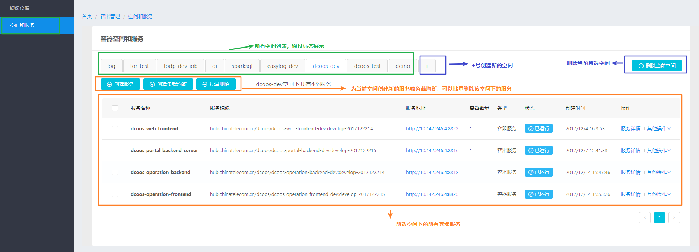

## 1. 容器空间

### 1）基本概念

* 空间是一个容器**服务组**的概念
* 一般一个应用对应一个空间，下面包含多个容器服务，比如分离的前后端服务、负载均衡服务等
* 页面中，容器空间是通过多个**标签页**来展示，点击对应空间的标签页，下面会展示该空间下所有的容器服务列表

### 2）创建容器空间

* 点击容器空间标签页最右边的**“+”号按钮**，弹出创建空间的页面

  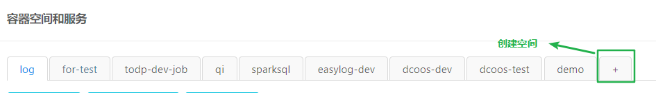

* 空间名称 （必填）- 语法限制字母数字和短横线

* 描述（选填） - 描述性语句

* 点击**“创建”按钮**，即可创建成功

  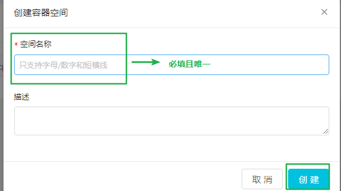

### 3）删除容器空间

* 首先**选中并点击**需要删除的空间的标签页！

  

* 跳出删除确认对话框

  因为删除空间会把下面所有的服务同时删除，是个需要**谨慎执行**的操作，对话框再次确认空间名称，确认后点击“确认”按钮执行删除操作

  

* 删除后，页面自动刷新，查看空间已被删除

## 2. 容器服务

选择容器空间后，页面下面部分则是该空间下所有容器服务的列表展示和相应操作，主要分为三部分：


* **最上一排按钮** - 创建服务和负载均衡，以及对容器服务的批量删除操作
* **中间主题展示部分** - 对容器服务的名称、使用镜像、对外的IP和端口、容器数量、容器类型、容器状态等展示
* **单个容器服务最右侧菜单** - 查看该服务下的容器实例详情，以及针对该容器的各种操作

### 1）创建容器服务

* 选中和点击想要为之创建服务的空间标签

* 点击**“创建服务”**按钮

  > 检查弹出对话框中的空间名称是否正确

  

  ​

* **步骤条一 - 选择镜像**

  > 一些基本信息，比如必填的服务名，可选填的描述

  

  > 点击**“选择镜像“**跳出镜像选择页面，选择所需的镜像和镜像版本

  

  

  ​

* **步骤条二 - 容器配置**

  > 一般常用配置为端口监听配置，前面一个是宿主机上映射的端口，后面一个是容器内部暴露出来的端口

  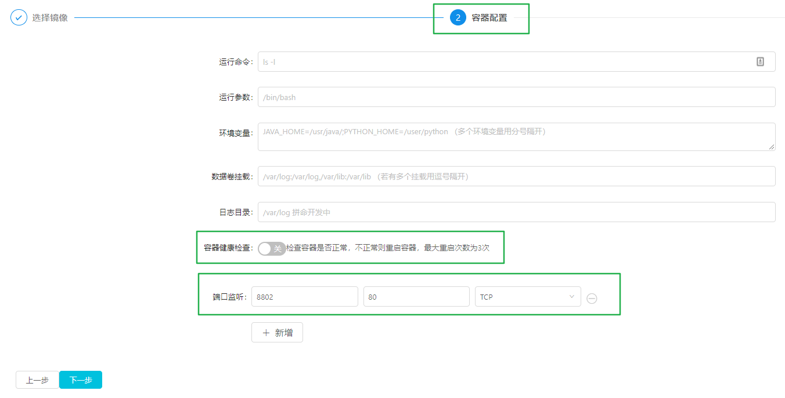

  ​

* **步骤条三 - 容器规格**

  > 这里主要配置一个容器数量，其他的CPU、内存和磁盘这里是作为预留，实际暂时不生效，使用默认值

  

  ​

* 点击“完成”后，显示服务创建成功，可以点击**“跳转至服务列表”**

  

  ​

* 查看创建成功的服务

  > 服务镜像即创建选择的镜像和版本，服务地址是随机选择的宿主机，端口是之前设置的监听端口，状态显示“已运行”

  

### 2）更新容器服务

有时候我们需要对容器的镜像版本进行升级，或者对端口，挂载磁盘，健康检查等进行更新，不需要重新创建容器服务，直接在之前已创建好的服务上进行容器更新操作即可。

* 服务最后边的“**操作**”列中的“**其他操作**”是下拉选项框，有很多操作选项，这里选择**“升级服务”**

  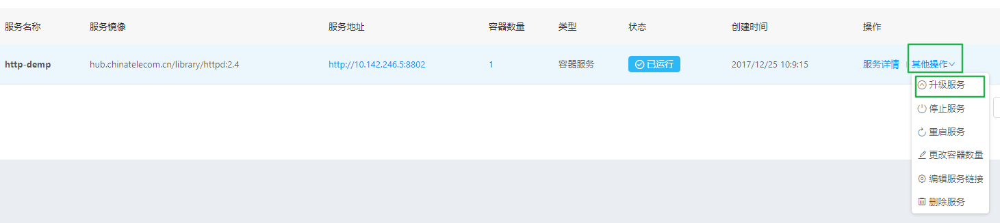

  ​

* **重新选择镜像或版本**

  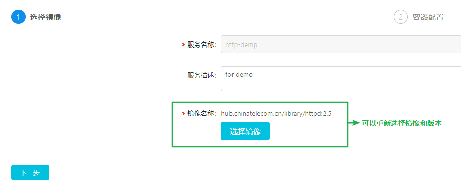

  ​

* 也可以修改一些**容器配置参数**

  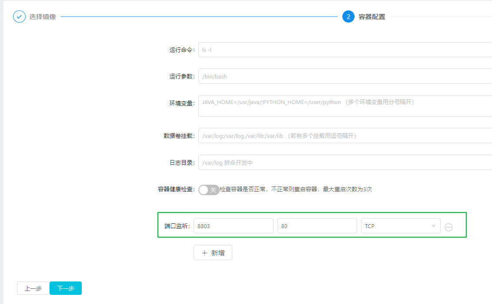

  ​

* **修改容器的数量**

  

  ​

* **升级完成**

  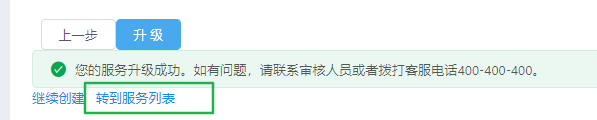

  

  ​

* **服务回滚**

  ```
  升级完成后，状态会变成**”升级完成“**而不是”运行中“状态，因为在这种状态下，用户还可以进行**”回滚服务“**操作，放弃这次升级操作，回到之前的版本。

  点击”其他操作“中的**”回滚服务“**按钮：（只有”升级完成“状态才有此按钮显示）
  ```

  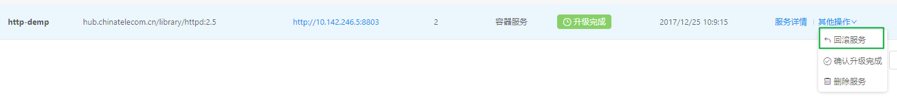

  ```
  检查回滚后的服务，可以看到镜像版本、端口和容器数量都恢复到和之前版本相同：
  ```

  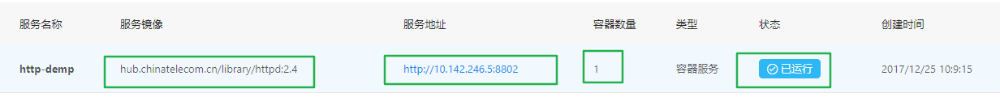

* **确认服务升级**

  如果在“升级完成”状态下，确认这次升级是需要的，则需要执行**“确认升级完成”**来完成这次升级任务

  

  等待服务状态变为“已运行”即为升级完成

### 3）停止/启动/重启/删除容器服务

* **停止容器服务**

  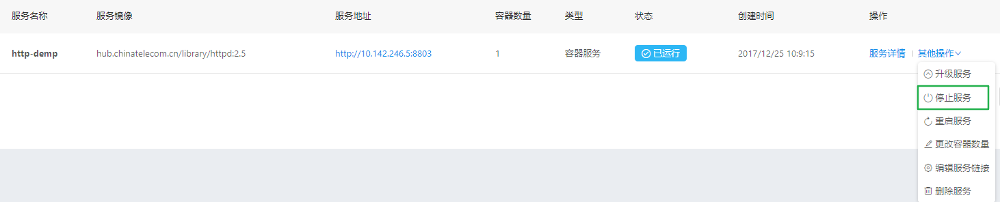

  

  

* **启动容器服务**

  

  

* **重启容器服务**

  

* **删除容器服务**

  

  

### 4）更改容器数量

相比更新容器服务，这里可以直接快速对容器服务进行扩展，调整容器服务数量

* 点击**“更改容器数量”**

  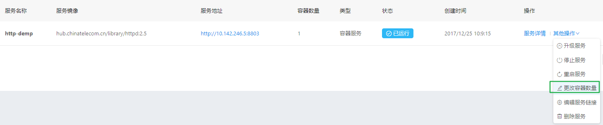

* 修改数量，点击确定

  

* 查看容器服务数量

  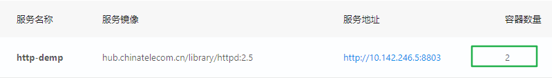

### 5）批量删除容器服务

如需一个空间下的多个容器服务，无需一个一个容器去进行删除操作，可以通过**多选框**选择要删除的容器，点击上方的**“批量删除”**按钮即可

* 多选需要删除的容器服务

  

* 点击**“批量删除”**，弹出删除确认框

  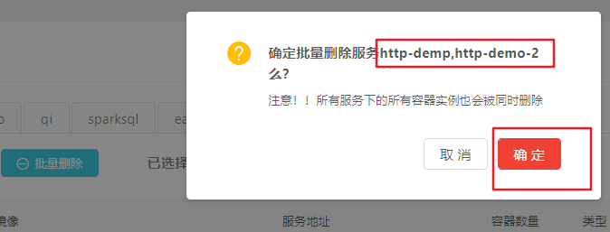

## 3. 容器实例

每个容器服务下面可以起多个容器实例，即我们设置的容器数量参数，如果想要查看具体的容器实例详情，可以点击每个服务**“操作”部分**的**“容器详情”**链接


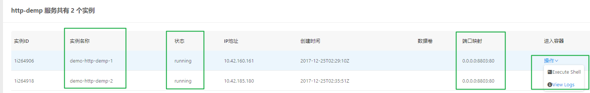

可以看到具体的容器实例的信息，比如每个实例运行的状态，容器内部和外部的端口映射，这里对于具体的容器实例，也提供了两个很有用的操作：

* Execute shell - 直接进入容器实例的终端界面
* view log - 查看容器主服务的日志

### 1）Execute Shell


### 2）View Logs


