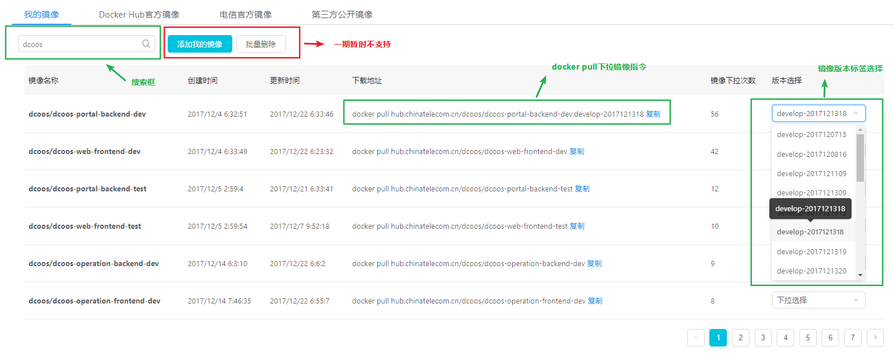

# 镜像仓库管理页面

点击左侧导航菜单第一行  > “镜像仓库”选项  > 展示容器镜像仓库管理页面

## 1. 镜像标签页分类

  目前镜像仓库通过标签页的方式分为四大类：

1. **我的镜像** - 主要展示当前用户自己管理的镜像列表（目前没介入权限，展示所有公开的容器镜像列表）
2. **Docker Hub官方镜像** - Docker官方基础镜像列表
3. **电信官方镜像** - 适用于电信项目的定制化基础镜像列表
4. **第三方公开镜像** - 用户对外公开和共享的第三方镜像列表

## 2. 镜像列表操作

* **分页展示** - 每个标签页最多展示10个镜像，更多镜像则通过分页展现
* **搜索框** - 每个标签页都有对应的搜索框，搜索框是对当前类型的镜像进行全局和模糊搜索
* **镜像版本选择** - 下拉会实时拉取最新的版本列表，点击选择
* **镜像下拉地址** - 选择镜像版本后，下载地址列会自动把版本加上，地址可复制
* **添加镜像和批量删除** - 一期暂不支持（一期暂时通过Jenkins方式打包和上传镜像）
